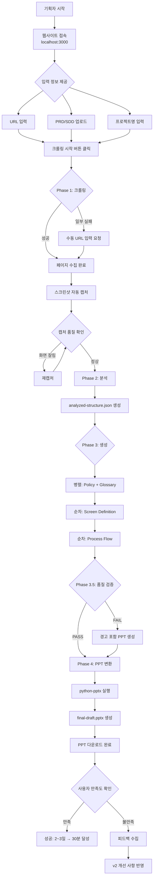
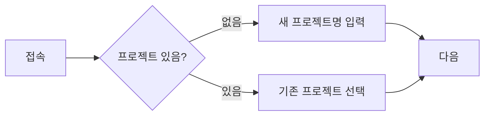
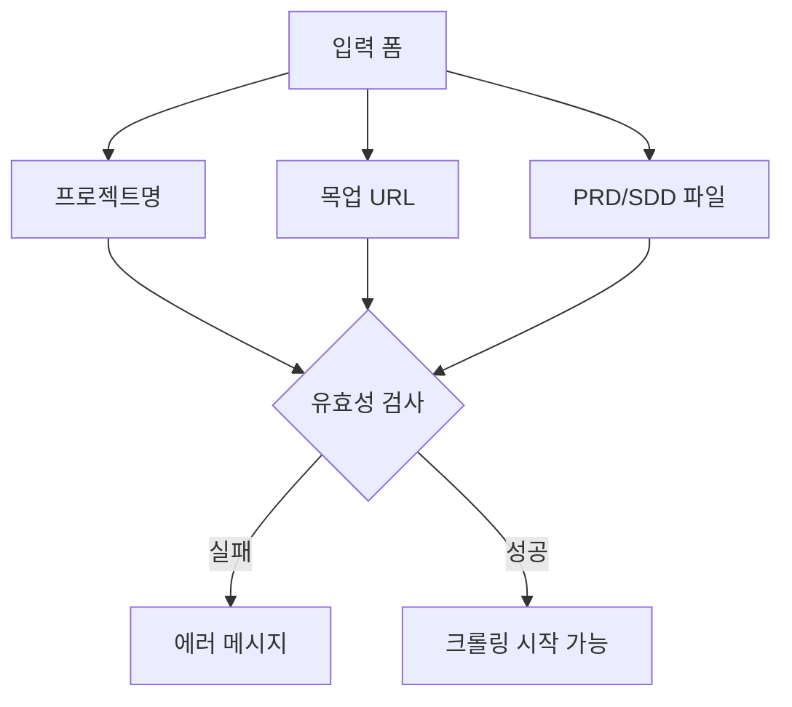
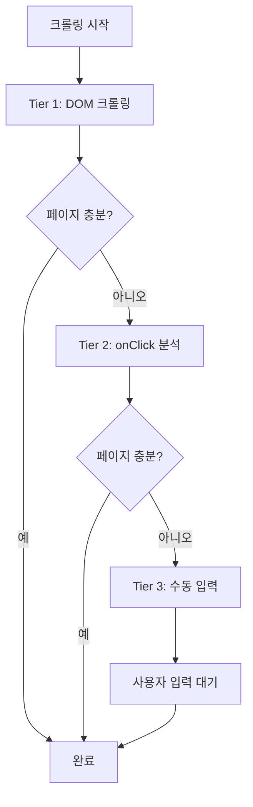
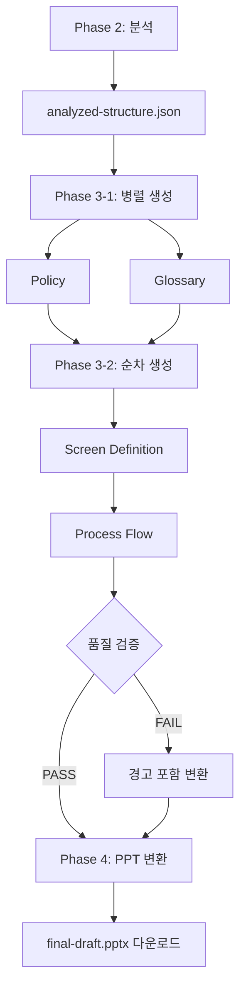
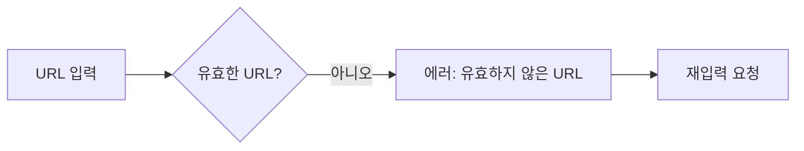
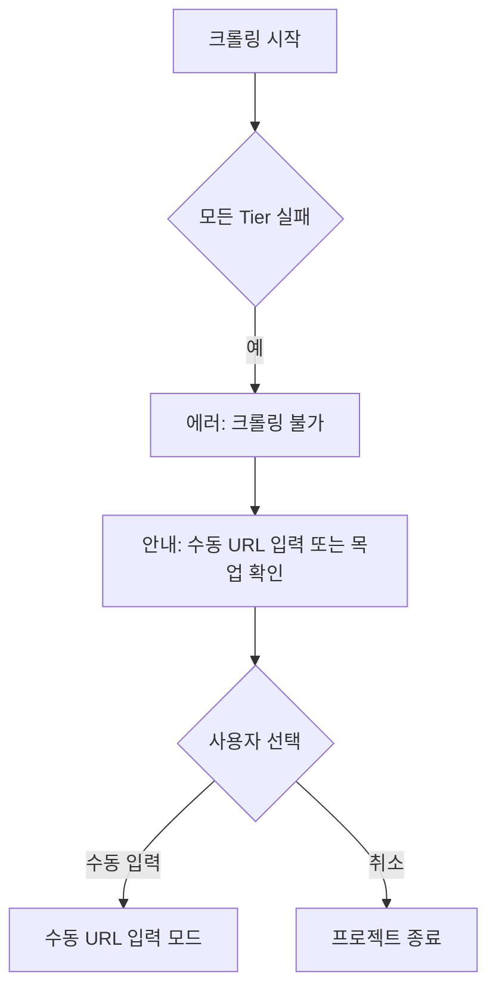
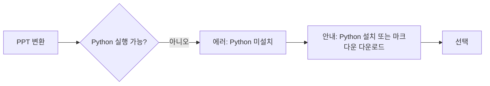

# User Flow (사용자 흐름도)

## 문서 메타데이터
| 항목 | 내용 |
|------|------|
| 세션 ID | draftify-userflow-v1.0 |
| 작성일 | 2026-01-04 |
| 버전 | v1.0 |

---

## 핵심 시나리오: 목업 → 기획서 PPT 생성 (FEAT-1 + FEAT-2 + FEAT-3)

---

## 상세 사용자 흐름

### Scenario 1: 정상 흐름 (Happy Path)

| 단계 | 화면 | 사용자 행동 | 시스템 반응 |
|------|------|-------------|-------------|
| 1 | 홈 | 프로젝트명 입력 | 입력 필드 표시 |
| 2 | 홈 | 목업 URL 입력 | URL 유효성 검사 |
| 3 | 홈 | PRD/SDD 파일 선택 | 파일 업로드 |
| 4 | 홈 | "크롤링 시작" 클릭 | 진행률 표시 시작 |
| 5 | 크롤링 중 | 대기 | "페이지 수집 중... (5/50)" |
| 6 | 분석 중 | 대기 | "AI 분석 중..." |
| 7 | 생성 중 | 대기 | "기획서 생성 중..." |
| 8 | 완료 | "PPT 다운로드" 클릭 | final-draft.pptx 다운로드 |

### Scenario 2: SPA 크롤링 실패 → 수동 입력

| 단계 | 화면 | 사용자 행동 | 시스템 반응 |
|------|------|-------------|-------------|
| 1-4 | (동일) | (동일) | (동일) |
| 5 | 크롤링 중 | 대기 | "Tier 1 크롤링 완료: 10페이지" |
| 6 | 수동 입력 | "일부 페이지를 찾지 못했습니다" 알림 | 수동 URL 입력 폼 표시 |
| 7 | 수동 입력 | 누락된 URL 직접 입력 | 추가 크롤링 실행 |
| 8 | (정상 흐름으로 복귀) | | |

---

## 사용자 행동별 상세 흐름

### 단계 1: 프로젝트 시작

### 단계 2: 입력 정보 제공

### 단계 3: 크롤링 (Phase 1)

### 단계 4: 생성 및 다운로드 (Phase 2-4)

---

## 오류 흐름 (Error Flows)

### E1: URL 유효성 실패

### E2: 크롤링 완전 실패

### E3: PPT 생성 실패

---

## 성공/실패 분기 정리

| 결과 | 조건 | 다음 단계 |
|------|------|-----------|
| **완전 성공** | 모든 Phase 성공 | PPT 다운로드 → 만족도 조사 |
| **부분 성공** | 일부 Phase 실패 | 경고 포함 PPT → 피드백 |
| **크롤링 실패** | 모든 Tier 실패 | 수동 입력 또는 종료 |
| **시스템 실패** | 치명적 오류 | 에러 로그 → 종료 |

---

**문서 끝**
