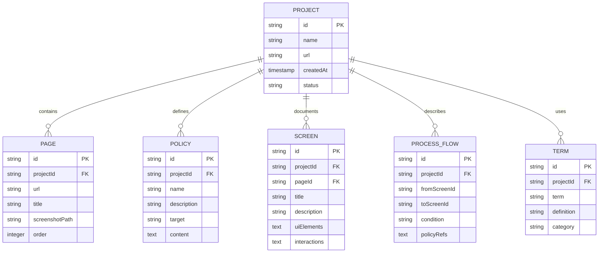

# Database Design (데이터베이스 설계)

## 문서 메타데이터
| 항목 | 내용 |
|------|------|
| 세션 ID | draftify-db-v1.0 |
| 작성일 | 2026-01-04 |
| 버전 | v1.0 |

---

## ERD (Entity Relationship Diagram)



---

## 상세 스키마 정의

### 1. PROJECT (프로젝트)

| 필드 | 타입 | 설명 | 제약 |
|------|------|------|------|
| id | string | 프로젝트 ID | UUID, PK |
| name | string | 프로젝트명 | NOT NULL |
| url | string | 목업 URL | NOT NULL |
| inputFiles | string[] | 첨부 파일 경로 | PRD, SDD, README |
| status | enum | 진행 상태 | `crawling` \| `analyzing` \| `generating` \| `completed` \| `failed` |
| createdAt | timestamp | 생성 시간 | DEFAULT now() |
| completedAt | timestamp | 완료 시간 | NULLABLE |

**TypeScript 인터페이스:**
```typescript
interface Project {
  id: string;
  name: string;
  url: string;
  inputFiles: string[];
  status: 'crawling' | 'analyzing' | 'generating' | 'completed' | 'failed';
  createdAt: Date;
  completedAt?: Date;
}
```

### 2. PAGE (크롤링된 페이지)

| 필드 | 타입 | 설명 | 제약 |
|------|------|------|------|
| id | string | 화면 ID | `SCR-001`, PK |
| projectId | string | 프로젝트 ID | FK → PROJECT |
| url | string | 페이지 URL | UNIQUE |
| title | string | 페이지 제목 | |
| screenshotPath | string | 스크린샷 경로 | `screenshots/SCR-001_1.png` |
| order | integer | 크롤링 순서 | |
| depth | integer | 깊이 | 0~5 |

**TypeScript 인터페이스:**
```typescript
interface Page {
  id: string;
  projectId: string;
  url: string;
  title: string;
  screenshotPath: string;
  order: number;
  depth: number;
}
```

### 3. POLICY (정책)

| 필드 | 타입 | 설명 | 제약 |
|------|------|------|------|
| id | string | 정책 ID | `POL-001`, PK |
| projectId | string | 프로젝트 ID | FK → PROJECT |
| name | string | 정책명 | |
| description | string | 설명 | |
| target | string | 대상 | |
| content | text | 내용 | |

**TypeScript 인터페이스:**
```typescript
interface Policy {
  id: string;
  projectId: string;
  name: string;
  description: string;
  target: string;
  content: string;
}
```

### 4. SCREEN (화면정의)

| 필드 | 타입 | 설명 | 제약 |
|------|------|------|------|
| id | string | 화면 ID | `SCR-001`, PK |
| projectId | string | 프로젝트 ID | FK → PROJECT |
| pageId | string | 연결 페이지 ID | FK → PAGE |
| title | string | 화면명 | |
| description | string | 설명 | |
| uiElements | json | UI 요소 | `[{type, label, location}]` |
| interactions | json | 상호작용 | `[{event, action}]` |

**TypeScript 인터페이스:**
```typescript
interface UIElement {
  type: string;
  label: string;
  location: string;
}

interface Interaction {
  event: string;
  action: string;
}

interface Screen {
  id: string;
  projectId: string;
  pageId: string;
  title: string;
  description: string;
  uiElements: UIElement[];
  interactions: Interaction[];
}
```

### 5. PROCESS_FLOW (프로세스 흐름)

| 필드 | 타입 | 설명 | 제약 |
|------|------|------|------|
| id | string | 흐름 ID | `FLOW-001`, PK |
| projectId | string | 프로젝트 ID | FK → PROJECT |
| fromScreenId | string | 출발 화면 | FK → SCREEN |
| toScreenId | string | 도착 화면 | FK → SCREEN |
| condition | string | 조건 | |
| policyRefs | string[] | 참조 정책 | `["POL-001", "POL-002"]` |

**TypeScript 인터페이스:**
```typescript
interface ProcessFlow {
  id: string;
  projectId: string;
  fromScreenId: string;
  toScreenId: string;
  condition: string;
  policyRefs: string[];
}
```

### 6. TERM (용어 사전)

| 필드 | 타입 | 설명 | 제약 |
|------|------|------|------|
| id | string | 용어 ID | `TERM-001`, PK |
| projectId | string | 프로젝트 ID | FK → PROJECT |
| term | string | 용어 | UNIQUE |
| definition | string | 정의 | |
| category | string | 카테고리 | `business` \| `technical` \| `ui` |

**TypeScript 인터페이스:**
```typescript
interface Term {
  id: string;
  projectId: string;
  term: string;
  definition: string;
  category: 'business' | 'technical' | 'ui';
}
```

---

## 관계 정의

### 1:1 관계
| 엔티티 A | 엔티티 B | 관계 |
|-----------|-----------|------|
| - | - | v1.0에서 없음 |

### 1:N 관계
| 부모 | 자식 | 관계 | 설명 |
|------|------|------|------|
| PROJECT | PAGE | 1:N | 한 프로젝트는 여러 페이지 |
| PROJECT | POLICY | 1:N | 한 프로젝트는 여러 정책 |
| PROJECT | SCREEN | 1:N | 한 프로젝트는 여러 화면 |
| PROJECT | PROCESS_FLOW | 1:N | 한 프로젝트는 여러 흐름 |
| PROJECT | TERM | 1:N | 한 프로젝트는 여러 용어 |
| PAGE | SCREEN | 1:1 | 한 페이지는 하나의 화면 (동일 ID) |

### M:N 관계
| 엔티티 A | 엔티티 B | 관계 | 중개 테이블 |
|-----------|-----------|------|-----------|
| SCREEN | POLICY | M:N | PROCESS_FLOW.policyRefs |

---

## 인덱싱 전략

| 테이블 | 인덱스 | 이유 |
|--------|--------|------|
| PAGE | `(projectId, order)` | 프로젝트 내 페이지 순서 조회 |
| PAGE | `projectId` | 프로젝트별 페이지 필터링 |
| SCREEN | `(projectId, pageId)` | 프로젝트 내 화면 조회 |
| SCREEN | `pageId` | 페이지별 화면 조회 |
| PROCESS_FLOW | `(projectId, fromScreenId)` | 출발 화면별 흐름 조회 |
| PROCESS_FLOW | `(projectId, toScreenId)` | 도착 화면별 흐름 조회 |
| TERM | `(projectId, term)` | 프로젝트 내 용어 고유성 |
| POLICY | `projectId` | 프로젝트별 정책 조회 |

---

## 파일시스템 기반 저장 구조

v1.0은 파일시스템을 사용하므로, 위 스키마는 JSON 파일로 저장:

```
outputs/<project-name>/
├─ analysis/
│  ├─ project.json              # PROJECT
│  ├─ pages.json                # PAGE[]
│  ├─ policies.json             # POLICY[]
│  ├─ screens.json              # SCREEN[]
│  ├─ flows.json                # PROCESS_FLOW[]
│  └─ terms.json                # TERM[]
└─ sections/                    # 마크다운 파일
```

**파일별 JSON 구조 예시:**

`pages.json`:
```json
{
  "pages": [
    {
      "id": "SCR-001",
      "projectId": "proj-uuid",
      "url": "https://example.com/home",
      "title": "홈",
      "screenshotPath": "screenshots/SCR-001_1.png",
      "order": 1,
      "depth": 0
    }
  ]
}
```

---

**문서 끝**
